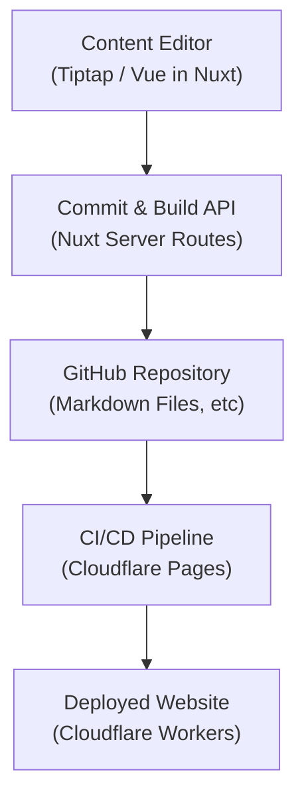

# Mamoochi - Headless, Git-Native, Serverless CMS & Web Platform Framework

Mamoochi is a modern, headless CMS and web platform framework designed for developers who value scalability, modularity, and a streamlined developer experience. By combining a Git-based workflow with real-time and decentralized features, Mamoochi offers a robust solution for building high-performance, content-rich websites and applications.

---

## 🚀 Overview

Mamoochi leverages cutting-edge technologies and serverless infrastructure to deliver a seamless headless experience. Key benefits include:

- **Headless-First Architecture:**  
  Clearly separated backend content management from frontend rendering, using Nuxt and Vue 3 for both Server-Side Rendering (SSR) and Static Site Generation (SSG).

- **Git-Native Versioning:**  
  Content edits become commits grouped into builds and pushed directly to GitHub, ensuring transparent and reliable version control.

- **Serverless & Globally Scalable:**  
  Powered by Cloudflare Workers, Durable Objects, D1, and KV storage for fast, auto-scaled, globally distributed deployments.

- **Real-Time & Decentralized:**  
  Real-time collaboration via Cloudflare Durable Objects and decentralized messaging and authentication with the Nostr protocol.

- **Extensible by Design:**  
  A flexible plugin system that enables customization of routes, middleware, dashboards, authentication methods, and monetization strategies.

---

## 🛠️ Architecture

### Frontend & User Interface

- **Nuxt & Vue 3:**  
  Enables powerful, reactive components with support for SSR and SSG for optimized performance and SEO.

- **Tiptap Markdown Editor:**  
  Rich-text visual editing with support for YAML front matter, enhancing content management without exposing metadata directly to editors.

- **TailwindCSS & Nuxt UI:**  
  Rapid and consistent UI development through utility-first CSS and a library of pre-built components.

### Backend & API

- **Cloudflare Workers:**  
  Serverless backend providing global, low-latency API responses without infrastructure overhead.

- **Cloudflare D1 & KV Storage:**  
  Structured, scalable data management through D1 SQL and fast, global key-value caching with KV storage.

- **Durable Objects:**  
  Real-time state management for collaborative features such as live editing, real-time updates, and persistent WebSocket connections.

- **Drizzle ORM:**  
  A type-safe, developer-friendly ORM that simplifies interactions with Cloudflare D1 databases.

### Git-Based Content Management & CI/CD

- **Commit & Build System:**  
  Changes are managed as commits with clear metadata, grouped into logical builds for organized review and controlled deployment.

- **GitHub Integration:**  
  Direct API-driven workflow:
  - Creates Git trees for modified files
  - Generates new commits on designated branches (e.g., `develop`, `main`)
  - Automatically triggers Cloudflare Pages CI/CD for deployment

### Architecture Diagram



### Real-Time & Decentralized Communication

- **Nostr Protocol:**  
  Decentralized identity, messaging, notifications, and collaborative real-time features without relying on centralized infrastructure.

- **Durable Objects:**  
  Ensures consistent real-time state management for collaborative editing and instant updates across users.

### Plugin & Extensibility

- **Modular Plugin System:**  
  Extensible architecture allowing developers to build custom integrations, middleware, routes, dashboards, and authentication workflows without altering core functionalities.

---

## 🌟 Key Features

- **Headless CMS:**
  Efficiently manage content with Markdown and YAML front matter through Git-based workflows.

- **Git-Native Versioning:**
  Built-in content versioning and rollback through commits and builds.

- **Serverless Infrastructure:**
  Optimized global backend powered by Cloudflare technologies.

- **Real-Time Collaboration:**
  Seamless real-time collaboration through decentralized messaging (Nostr) and stateful Durable Objects.

- **Developer-Friendly Tooling:**
  Leverages modern tools like Nuxt, Vue 3, TailwindCSS, Drizzle ORM, ESLint, Prettier, and Vitest for enhanced productivity.

- **Plugin Architecture:**
  Effortlessly customizable and extendable through plugins and middleware.

---

## 📖 Getting Started

### Prerequisites

- **Node.js (v18+)**
- **pnpm (recommended), npm, or yarn**
- **Cloudflare Wrangler CLI**
- **GitHub Account**

### Installation

1\. **Clone the Repository:**

```sh
git clone git@github.com:bagche/mamoochi.git
cd mamoochi
pnpm install
```

2\. **Run Development Server:**

```sh
pnpm dev
```

Visit `http://localhost:3000` to view your application.

3\. **Production Build:**

```sh
NITRO_PRESET=cloudflare-pages pnpm build
```

4\. **Deploy to Cloudflare Pages:**

```sh
npx wrangler pages deploy
```

---

## 📝 License

Mamoochi is open-sourced under the [MIT License](LICENSE).

---

Mamoochi is actively evolving, driven by open-source principles and community collaboration. Our goal is to empower developers with a scalable, modular, and performant platform for building exceptional web experiences.
