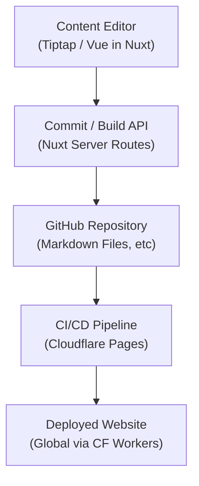

# Mamochi - Headless, Git-Native, Serverless CMS & Web Platform Framework

Mamochi is a modern, headless content management and web platform framework built for developers who need a scalable, modular, and developer-friendly environment. It combines a Git-based workflow with real-time, decentralized features to deliver a robust system for building content-rich websites and applications.

---

## Overview

Mamochi leverages cutting-edge technologies and serverless infrastructure to deliver a headless-first experience. Key aspects include:

- **Headless-First Architecture:**  
  Decoupled backend content management and frontend rendering with Nuxt and Vue 3, providing both Server-Side Rendering (SSR) and Static Site Generation (SSG) for fast, SEO-friendly sites.

- **Git-Native Versioning:**  
  Every content edit is stored as a commit, grouped into builds, and pushed to GitHub—ensuring full version control and auditability.

- **Serverless & Scalable:**  
  Powered by Cloudflare Workers, Durable Objects, D1, and KV storage, Mamochi offers global low-latency performance with auto-scaling capabilities.

- **Real-Time Collaboration & Decentralization:**  
  Integrates Cloudflare’s real-time technologies and the Nostr protocol for decentralized messaging and identity, enabling real-time notifications and collaboration.

- **Modular & Extensible:**  
  A robust plugin system allows easy extension of core features such as custom routes, middleware, dashboards, authentication, and monetization strategies.

---

## Architecture

### Frontend & User Interface

- **Nuxt & Vue 3:**  
  Mamochi uses Nuxt (v3/4) and Vue 3 for dynamic SSR and SSG. This combination provides a reactive, high-performance UI and seamless developer experience.

- **Tiptap Editor:**  
  A rich, visual Markdown editor that supports YAML front matter. It allows content creators to edit the body of pages without disturbing metadata.

- **TailwindCSS & Nuxt UI:**  
  Rapid, utility-first styling and a library of pre-built UI components speed up the development process and maintain visual consistency.

### Backend & API

- **Cloudflare Workers:**  
  The serverless backend is deployed on Cloudflare Workers for global distribution and low-latency API responses.

- **Cloudflare D1 & KV Storage:**  
  Use Cloudflare’s serverless SQL (D1) for structured data and KV storage for caching and session management.

- **Durable Objects:**  
  Manage real-time state and collaborative features such as live editing and dashboards. Durable Objects ensure consistent data across sessions and regions.

- **Drizzle ORM:**  
  A type-safe SQL query builder that simplifies interactions with Cloudflare D1, reducing runtime errors and speeding up development.

### Commit/Build System & GitHub Integration

- **Commit System:**  
  Each edit to a Markdown page is stored as a commit that includes the file path, content, and commit message. This enables granular version control.

- **Build Aggregation:**  
  Commits are grouped into builds. Administrators review builds and trigger the push process, which:
  - Creates a new Git tree that updates only modified files.
  - Creates a new commit on a target branch (e.g., `develop`).
  - Updates the branch reference via the GitHub API.
- **CI/CD Integration:**  
  Once a build is pushed, GitHub triggers Cloudflare Pages CI/CD to deploy the updated content seamlessly.

### Detailed Architecture Diagram

Below is a high-level diagram outlining the key data flows and system components:

Here's the **Mermaid chart** version of your system architecture:



### Real-Time & Decentralized Communication

- **Nostr Protocol Integration:**  
  Mamochi integrates with Nostr for decentralized identity and messaging. This enables real-time notifications, chat, and collaborative editing without relying on centralized servers.

- **Real-Time State with Durable Objects:**  
  Durable Objects coordinate live sessions, ensuring that multiple users can collaborate on content and see updates in real time.

### Plugin & Extensibility System

- **Modular Plugin Architecture:**  
  Developers can extend or override core functionalities using plugins. This system supports custom routes, middleware, dashboards, authentication methods, and integrations without modifying the core codebase.

---

## Key Features

- **Headless CMS:**  
  Manage Markdown-based content (with YAML front matter) in a Git-based workflow.
- **Git-Native Versioning:**  
  Every edit is versioned as a commit; builds aggregate commits and trigger controlled pushes to GitHub.

- **Serverless Infrastructure:**  
  Leverages Cloudflare Workers, D1, KV, and Durable Objects for high-performance, scalable backend operations.

- **Real-Time Collaboration:**  
  Built-in real-time state management and decentralized messaging with the Nostr protocol enable collaborative features.

- **Extensible & Modular:**  
  A plugin-based system that lets you extend functionalities easily, from custom dashboards to authentication strategies.

- **Developer-Friendly:**  
  Utilizes modern tools such as Nuxt, Vue 3, TailwindCSS, Drizzle ORM, ESLint, Prettier, and Vitest to create an optimal development experience.

---

## Getting Started

### Prerequisites

- **Node.js (v18+)**
- **pnpm (or npm/yarn)**
- **Cloudflare CLI (Wrangler)** for deployment
- **GitHub Account** with repository access for Git-based content management

### Installation

1. **Clone the Repository:**

```sh
  git clone git@github.com:bagche/mamoochi.git
  cd mamoochi
  pnpm install
```

2. **Start the Development Server:**

   ```sh
   pnpm dev
   ```

   Visit `http://localhost:3000` to see the application in action.

3. **Build for Production:**

   ```sh
   NITRO_PRESET=cloudflare-pages pnpm build
   ```

4. **Deploy to Cloudflare Workers:**

   ```sh
   npx wrangler pages deploy
   ```

---

## License

Mamochi is released under the **MIT License**.

---

Mamochi is an evolving project that embraces open-source principles, community collaboration, and cutting-edge web technologies to empower developers in building scalable, modular, and high-performance web applications.
